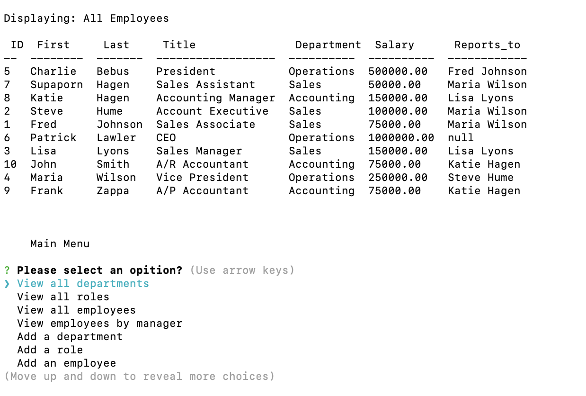

 [](https://opensource.org/licenses/MIT)
 # Nonya Business - Employee Tracker
 ## *Table of Contents*
1. [Description](#description)
2. [Usage Information](#usage-information)
3. [Installation Instructions](#installation-instructions)
4. [Tests](#tests)
5. [Questions](#questions)
6. [License Info](#license-info)

 _ _ _
 ## *Description*
 ### This is my submission for the week 12 challenge. A command-line application, from scratch, to manage a company's employee database, using Node.Js, Inquirer and MySQL. The user story:
```
GIVEN a command-line application that accepts user input
WHEN I start the application
THEN I am presented with the following options: view all departments, view all roles, view all employees, add a department, add a role, add an employee, and update an employee role
WHEN I choose to view all departments
THEN I am presented with a formatted table showing department names and department ids
WHEN I choose to view all roles
THEN I am presented with the job title, role id, the department that role belongs to, and the salary for that role
WHEN I choose to view all employees
THEN I am presented with a formatted table showing employee data, including employee ids, first names, last names, job titles, departments, salaries, and managers that the employees report to
WHEN I choose to add a department
THEN I am prompted to enter the name of the department and that department is added to the database
WHEN I choose to add a role
THEN I am prompted to enter the name, salary, and department for the role and that role is added to the database
WHEN I choose to add an employee
THEN I am prompted to enter the employee’s first name, last name, role, and manager, and that employee is added to the database
WHEN I choose to update an employee role
THEN I am prompted to select an employee to update and their new role
```

 
 _ _ _
 ## *Usage Information*
  It's a very simple CMS application, just follow the command line prompts to Create, Read, Update and Delete records in the database
  - Walkthroug Video: https://drive.google.com/file/d/1AV_sWs2gjyG9qidyV1IRe05ERC79dzM2/view
  - GitHub Repository: https://github.com/pjlawler/nonya_business
  - - -
 ## *Installation Instructions*
  The only requirement is to install npm from the command line when installing. You many update the db/seeds.sql with your deparments, roles and employee information.
  - - -
 ## *Tests*
  none
  - - -
 
 ## *Questions*
 ###   For questions or comments concerning this project please contact, Patrick J. Lawler, the author, owner and manager the work via either github or email. Links for each are listed below.
 - GitHub [pjlawler](https://github.com/pjlawler)
 - eMail: patlaw777@icloud.com
 _ _ _
 ## *License Info*
  [](https://opensource.org/licenses/MIT)  Copyright Ⓒ 2022 Patrick J. Lawler
      
    Permission is hereby granted, free of charge, to any person obtaining a copy of this software and associated documentation files (the "Software"), to deal in the Software without restriction, including without limitation the rights to use, copy, modify, merge, publish, distribute, sublicense, and/or sell copies of the Software, and to permit persons to whom the Software is furnished to do so, subject to the following conditions:
    
    The above copyright notice and this permission notice shall be included in all copies or substantial portions of the Software.
    
    THE SOFTWARE IS PROVIDED "AS IS", WITHOUT WARRANTY OF ANY KIND, EXPRESS OR IMPLIED, INCLUDING BUT NOT LIMITED TO THE WARRANTIES OF MERCHANTABILITY, FITNESS FOR A PARTICULAR PURPOSE AND NONINFRINGEMENT. IN NO EVENT SHALL THE AUTHORS OR COPYRIGHT HOLDERS BE LIABLE FOR ANY CLAIM, DAMAGES OR OTHER LIABILITY, WHETHER IN AN ACTION OF CONTRACT, TORT OR OTHERWISE, ARISING FROM, OUT OF OR IN CONNECTION WITH THE SOFTWARE OR THE USE OR OTHER DEALINGS IN THE SOFTWARE.